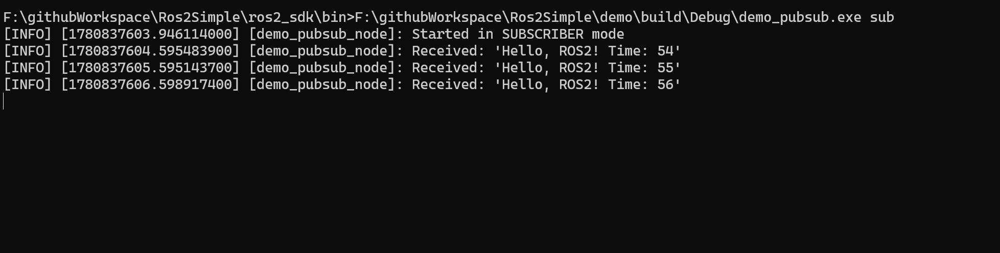
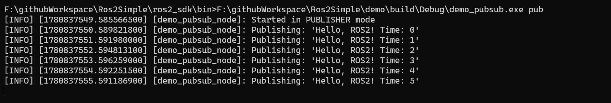

# Ros2Simple - Windows ROS2 SDK

[中文文档](#中文文档) | [English Documentation](#english-documentation)

---

## 中文文档

### 项目简介

**Ros2Simple** 是一个基于 **ROS2 Humble** 在 Windows x64 Debug 模式下编译的 ROS2 SDK。**无需安装 ROS2 原生工具链**，可以直接使用 CMake 进行编译。本项目旨在简化 Windows 平台上的 ROS2 开发流程，让开发者摆脱复杂的环境配置。

同时，本 SDK 也可以交叉编译到 **Linux** 和 **ARM-Linux** 平台，方便工业产品的量产化部署。

### 运行效果

<p align="center">
  
  
</p>

<p align="center">
  <em>左：Publisher 发布消息 &nbsp;&nbsp;|&nbsp;&nbsp; 右：Subscriber 接收消息</em>
</p>

### 特性

- **基于 ROS2 Humble**：使用 ROS2 Humble 源码编译，稳定可靠
- **Windows x64 Debug 版本**：当前提供 Windows x64 Debug 编译版本
- **无需 ROS2 原生工具链**：不依赖 `rosdep`、`colcon` 等 ROS2 原有构建工具
- **CMake 直接编译**：使用标准 CMake 即可编译 ROS2 应用程序
- **开箱即用**：SDK 内置所有必需的头文件、库文件和运行时依赖
- **跨平台部署**：可编译到 Linux、ARM-Linux 等平台，支持工业产品化部署
- **轻量化**：只包含核心 ROS2 组件，体积精简

### 项目结构

```
Ros2Simple/
├── demo/                   # 示例工程
│   ├── CMakeLists.txt      # CMake 构建文件
│   ├── include/            # 示例头文件
│   └── src/
│       └── talker.cpp      # 发布/订阅示例代码
└── ros2_sdk/               # ROS2 SDK
    ├── bin/                # 可执行文件
    ├── cmake/              # CMake 配置文件
    ├── include/            # 头文件
    ├── lib/                # 库文件
    └── share/              # 共享资源
```

### 快速开始

#### 环境要求

- Windows 10/11 x64
- CMake 3.10 或更高版本
- Visual Studio 2019/2022（需要 C++17 支持）
- 支持的编译器：MSVC

#### 编译步骤

1. 克隆本项目：
   ```bash
   git clone https://github.com/your-username/Ros2Simple.git
   cd Ros2Simple
   ```

2. 编译示例程序：
   ```bash
   cd demo
   mkdir build && cd build
   cmake ..
   cmake --build . --config Debug
   ```

3. 运行发布者节点：
   ```bash
   # 需要将 ros2_sdk/bin 和 ros2_sdk/lib 添加到 PATH 环境变量
   demo_pubsub.exe pub
   ```

4. 运行订阅者节点（新开终端）：
   ```bash
   demo_pubsub.exe sub
   ```

### 使用方法

将 `ros2_sdk` 目录作为你项目的依赖路径，在你的 `CMakeLists.txt` 中指定：

```cmake
set(ROS2_DIR "path/to/ros2_sdk")
include_directories(${ROS2_DIR}/include)
link_directories(${ROS2_DIR}/lib)
```

### 跨平台部署

本 SDK 当前提供 **Windows x64 Debug** 版本，同时支持编译到以下平台：

- **Linux x64**：适用于服务器和桌面端部署
- **ARM-Linux**：适用于嵌入式设备和工业控制器

如有跨平台编译需求，欢迎联系商业支持。

### 配套工具

推荐配合 [Rivz2Windows](../Rivz2Windows) 使用 —— 一个可以直接双击运行的 Windows 版 RViz2 可视化工具。

### 开源协议

本项目中的 ROS2 SDK 基于 **ROS2 Humble** 源码编译，遵守 ROS2 的开源协议（Apache License 2.0 / BSD License）。
请参阅各组件的原始许可证文件。

### 商业支持 / Commercial Support

本项目完全免费开源，遵循 ROS2 原始开源协议。如果您需要额外的技术支持，可联系获取付费商业服务：

- **邮箱 / Email**：huming516520@gmail.com

服务内容 / Services：
- ROS2 Windows / Linux / ARM-Linux 平台定制化编译 / Custom builds for multiple platforms
- ROS2 项目技术咨询与架构设计 / Consulting and architecture design
- 嵌入式/机器人系统集成方案 / Embedded/robotics system integration
- 工业产品化部署方案 / Industrial deployment solutions
- 技术培训与文档支持 / Technical training and documentation

---

## English Documentation

### Introduction

**Ros2Simple** is a pre-compiled ROS2 SDK based on **ROS2 Humble**, built in Windows x64 Debug mode. **No native ROS2 toolchain is required** — you can build ROS2 applications directly using CMake. This project aims to simplify ROS2 development on Windows by eliminating complex environment setup.

The SDK can also be cross-compiled for **Linux** and **ARM-Linux** platforms, enabling convenient deployment for industrial products.

### Screenshots

<p align="center">
  
  
</p>

<p align="center">
  <em>Left: Publisher sending messages &nbsp;&nbsp;|&nbsp;&nbsp; Right: Subscriber receiving messages</em>
</p>

### Features

- **Based on ROS2 Humble**: Compiled from ROS2 Humble source code, stable and reliable
- **Windows x64 Debug Build**: Currently provides Windows x64 Debug version
- **No ROS2 Toolchain Required**: No dependency on `rosdep`, `colcon`, or other native ROS2 build tools
- **CMake Native Build**: Build ROS2 applications using standard CMake
- **Ready to Use**: SDK includes all necessary headers, libraries, and runtime dependencies
- **Cross-Platform Deployment**: Can be compiled for Linux, ARM-Linux, and other platforms for industrial deployment
- **Lightweight**: Contains only core ROS2 components with a minimal footprint

### Project Structure

```
Ros2Simple/
├── demo/                   # Demo project
│   ├── CMakeLists.txt      # CMake build file
│   ├── include/            # Demo headers
│   └── src/
│       └── talker.cpp      # Publisher/Subscriber example
└── ros2_sdk/               # ROS2 SDK
    ├── bin/                # Executables
    ├── cmake/              # CMake configuration files
    ├── include/            # Header files
    ├── lib/                # Libraries
    └── share/              # Shared resources
```

### Quick Start

#### Prerequisites

- Windows 10/11 x64
- CMake 3.10 or higher
- Visual Studio 2019/2022 (C++17 support required)
- Supported compiler: MSVC

#### Build Steps

1. Clone the repository:
   ```bash
   git clone https://github.com/your-username/Ros2Simple.git
   cd Ros2Simple
   ```

2. Build the demo:
   ```bash
   cd demo
   mkdir build && cd build
   cmake ..
   cmake --build . --config Debug
   ```

3. Run the publisher node:
   ```bash
   # Add ros2_sdk/bin and ros2_sdk/lib to your PATH environment variable
   demo_pubsub.exe pub
   ```

4. Run the subscriber node (in a new terminal):
   ```bash
   demo_pubsub.exe sub
   ```

### Usage

Use the `ros2_sdk` directory as a dependency path in your project. Reference it in your `CMakeLists.txt`:

```cmake
set(ROS2_DIR "path/to/ros2_sdk")
include_directories(${ROS2_DIR}/include)
link_directories(${ROS2_DIR}/lib)
```

### Cross-Platform Deployment

This SDK currently provides the **Windows x64 Debug** version, and also supports compilation for:

- **Linux x64**: Suitable for server and desktop deployment
- **ARM-Linux**: Suitable for embedded devices and industrial controllers

For cross-platform compilation needs, please contact for commercial support.

### Companion Tool

Recommended to use with [Rivz2Windows](../Rivz2Windows) — a standalone, double-click-to-run RViz2 visualization tool for Windows.

### License

The ROS2 SDK in this project is compiled from **ROS2 Humble** source code and is subject to the original ROS2 licenses (Apache License 2.0 / BSD License).
Please refer to the original license files of each component.

### Commercial Support

This project is free and open source under the original ROS2 licenses. Paid commercial support services are available if needed:

- **Email**: huming516520@gmail.com

Services available:
- Custom ROS2 builds for Windows / Linux / ARM-Linux platforms
- ROS2 project consulting and architecture design
- Embedded/robotics system integration solutions
- Industrial deployment solutions
- Technical training and documentation support
